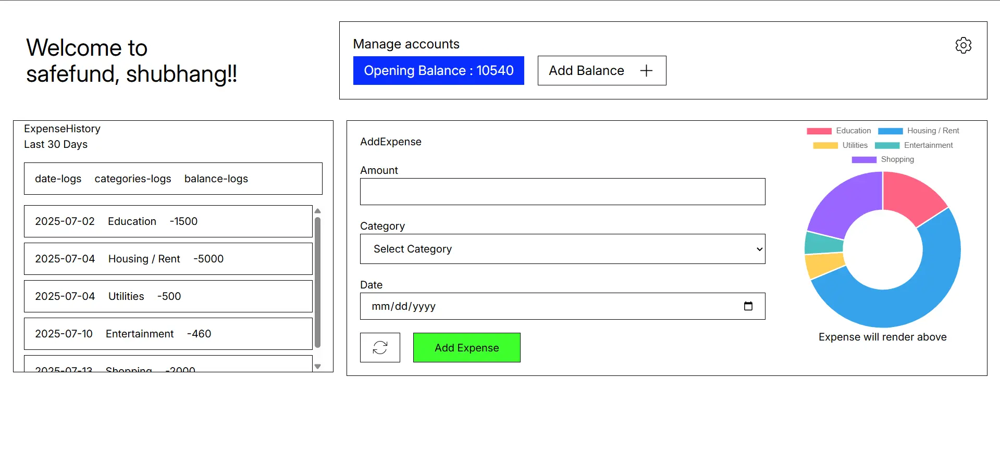

## Expense Tracker with Authentication

Hey there! This is my little project to build a super Simple Expense Tracker. The goal is to help me (and maybe you!) keep tabs on where all the money goes. It's still a work in progress, but here's what's cooking! 🚀

- User authentication (Firebase or Express+JWT)
- Frontend: React with Tailwind
- Backend: Node.js Express with MongoDB
- CRUD operations
- At last: Graphs for expense categories

**Here's a sneak peek of the design:** ✨

Check out the full design file on Figma here: [https://www.figma.com/design/JXM6HpxK7wvFylKCqBlD5O/shubhang?node-id=0-1&t=rCbRT7x3STi2QFOR-1](https://www.figma.com/design/JXM6HpxK7wvFylKCqBlD5O/shubhang?node-id=0-1&t=rCbRT7x3STi2QFOR-1)
