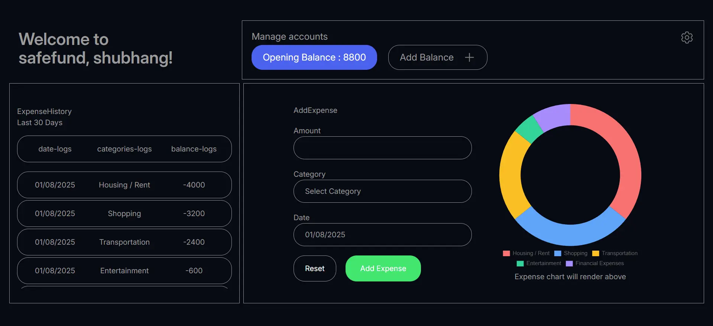

# Expense Tracker App

A web application to manage personal finances.
Built with the MERN stack and includes authentication + basic CRUD features.

---

## Features

- User authentication (JWT + bcrypt)
- Add and view expenses
- Track remaining balance
- Expense history log
- Frontend: React + Tailwind CSS
- Backend: Node.js + Express
- Database: MongoDB (Atlas)
- More Graphs for expense categories (coming soon)

---

## Preview

Figma Design: [Click here](https://www.figma.com/design/JXM6HpxK7wvFylKCqBlD5O/shubhang?node-id=0-1&t=rCbRT7x3STi2QFOR-1)
